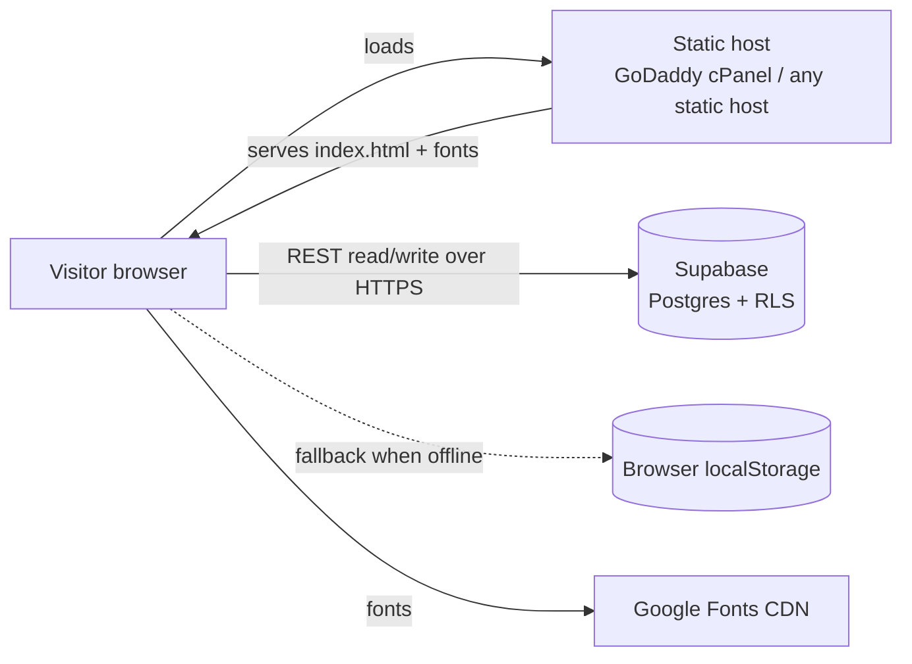
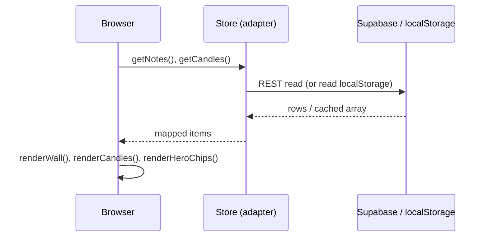

# JLU — "Jesus Loves You" · Architecture

**Version:** 1.0 · **Date:** 2026-06-29
Companion to `FUNCTIONAL-SPEC.md`. Describes structure, data flow, and extension points.

---

## 1. System context



- The site is a **single static HTML file**. There is **no application server** of our own.
- The only stateful backend is **Supabase** (Postgres + PostgREST + Row-Level Security).
- If Supabase is unreachable, the browser's **localStorage** transparently takes over.

---

## 2. File structure

```
jesus-loves-you/
├── index.html              # entire app: markup + CSS + JS + inline SVG (the deployable)
├── hero-jesus.svg          # standalone Jesus illustration (optional; book scene is inline in index.html)
├── SUPABASE-SETUP.md       # DB creation steps + SQL
├── PUBLISH-GoDaddy.md      # cPanel hosting steps
├── PUBLISH-Free.md         # Netlify/Cloudflare alternative
├── FUNCTIONAL-SPEC.md      # numbered functional + non-functional requirements
├── ARCHITECTURE.md         # this file
├── ROADMAP.md              # prioritized milestones
├── PROJECT-LOG.md          # running project record
├── DEPLOY.md               # (reference) original Wix Headless path
└── setup-wix-collections.sh# (reference) Wix helper
```

Everything the browser needs is inside `index.html`. Other files are documentation/tooling.

---

## 3. Runtime architecture (inside index.html)

Vanilla JS, no framework, no build. Organized as: **config → storage layer → data → render
functions → event wiring → boot**.

```
CONFIG            WIX{}, SUPA{}                     ← where the shared wall is switched on
        │
STORAGE LAYER     Local (localStorage)              ← the adapter pattern; all share one interface:
                  makeSupa() (Supabase REST)          getNotes/addNote/getCandles/addCandle
                  makeWix()  (Wix CMS, optional)
                  Store = chosen adapter
        │
DATA (editable)   SEED_NOTES, SEED_CANDLES, VERSES,
                  STICKERS, FLIPCARDS, TAG_* maps
        │
RENDER            BOOK_SVG(), buildStickers(), buildFlips(),
                  renderVerses(), renderWall(), renderCandles(),
                  renderHeroChips(), celebrateNote()
        │
EVENTS            noteForm submit, candleForm submit, filters,
                  candle click (reveal), sticker drag, card flip
        │
BOOT              choose Store → render everything → load wall + candles
```

### Storage adapter (key design pattern)
All three backends implement the **same four-method interface**, so the rest of the app never
knows which is active:
```
getNotes()  → [ {text, author, tag, _createdDate}, … ]
addNote(n)  → persists one note
getCandles()→ [ {name, type, intention, _createdDate}, … ]
addCandle(c)→ persists one candle
```
`boot()` selects the adapter by precedence: **Supabase → Wix → localStorage**. Supabase/Wix adapters
wrap every call in try/catch and fall back to `Local` on error, so a network failure never breaks the UI.

---

## 4. Key data flows

### Load (page open)


### Post a note (with flip-to-verse)
```mermaid
sequenceDiagram
  participant U as User
  participant App
  participant St as Store
  U->>App: submit note
  App->>App: spamCheck() (cooldown/dupe/links/length/words)
  alt blocked
    App-->>U: kind inline message
  else allowed
    App->>App: prepend to wall, renderWall(), renderHeroChips()
    App->>App: celebrateNote() → flip polaroid to matching KJV verse
    App->>St: addNote() (async; localStorage fallback on error)
    App-->>U: scroll to wall
  end
```

### Light a candle
Same shape: `spamCheck(intention)` → prepend + `renderCandles()` + `renderHeroChips()` →
`addCandle()` (async, fallback). Rendered candles show a type label; clicking one toggles a popover
with its intention.

---

## 5. Component inventory (UI)

| Component | Source | Notes |
|---|---|---|
| Nav bar | static markup | anchor links |
| Hero book illustration | `BOOK_SVG()` inline SVG | dove + olive + pages |
| Draggable stickers | `buildStickers()` | pointer events |
| Flip cards | `buildFlips()` + CSS 3D | tap to flip |
| Live chips | `renderHeroChips()` | latest note + candle |
| Candle modal + wall | `candleForm`, `renderCandles()` | type label + reveal popover |
| Verse cards | `renderVerses()` | filter + "start a note" |
| Note composer | `noteForm` | validation + spam guard |
| Flip celebration | `celebrateNote()` + `#flipModal` | note → verse |
| Community wall | `renderWall()` | masonry + tag filters |
| Footer | static markup | closing verse |

---

## 6. Extension points (where to add features)

- **New verses / themes** → append to the `VERSES` array (and theme filters).
- **New sticker / flip card** → add to `STICKERS` / `FLIPCARDS`.
- **New candle/note field** → add a column in Supabase (§7 of the spec), extend the form, the
  `add*`/`get*` mappers, and the render function.
- **New backend (e.g. Firebase)** → implement the four-method adapter and select it in `boot()`.
- **Reactions/counts, search, pagination** → new render + query logic against the same tables.
- **Member accounts** → introduces auth; would change RLS to per-user policies and add a session layer
  (this is the main architectural step-up flagged in the roadmap).

---

## 7. Tech stack & dependencies

- **Language/UI:** HTML5, CSS3 (variables, 3D transforms, keyframes), vanilla ES2017+ JS.
- **Fonts:** Google Fonts — Caveat, Kalam, Lora.
- **Backend:** Supabase (Postgres + PostgREST + RLS). REST via `fetch`. No SDK/bundler required.
- **Build:** none. **Hosting:** any static host.
- **Runtime external calls:** Google Fonts (load), Supabase REST (data). Nothing else.

---

## 8. Security & privacy posture

- Only the **public anon/publishable** Supabase key ships to the client; **RLS** limits it to
  read + insert. No secret keys, no server code, no PII required.
- Data is **shared/public** by design (anonymous community wall). Per-user privacy is a v2 concern
  requiring authentication (see `ROADMAP.md`).
- Spam defense is client-side + DB length constraints in v1; server-side rate limiting is a roadmap item.
```
